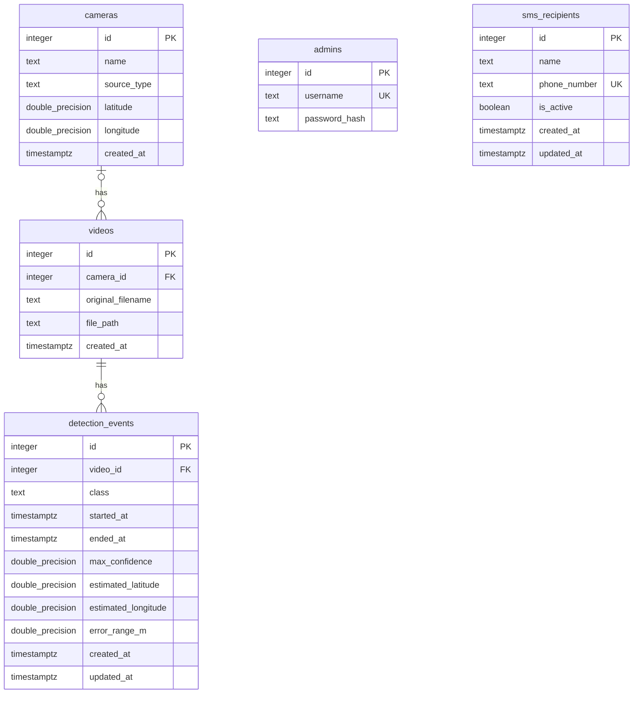

# FireGuard AI 데이터베이스 명세와 ERD

[README](../README.md) · [시스템 아키텍처](System_architecture.md) · [API 명세](API_SPEC.md) · [초기 스키마](../sql/init.sql)

스키마 기준: [`sql/init.sql`](../sql/init.sql) · 개발 데이터: [`sql/seed.dev.sql`](../sql/seed.dev.sql)

## ERD

- 카메라 1대는 영상 0개 이상 보유
- 영상은 카메라 0대 또는 1대와 연결
- 탐지 이벤트는 영상 1개에 연결
- SMS 수신자 목록은 시스템 공용
- `PK`는 기본 키, `FK`는 외래 키, `UK`는 고유 제약

## 공통 규칙

- ID는 자동 생성 정수
- 시각은 `TIMESTAMPTZ`, API 응답은 UTC ISO 8601
- 참조 중인 카메라·영상은 연쇄 삭제하지 않음

## 테이블별 필드

### `cameras` · 카메라 설치 정보

| 필드 | 입력 | 의미·제약 |
| --- | --- | --- |
| `id` | 자동 | 기본 키 |
| `name` | 필수 | 공백 불가, 고유 제약 없음 |
| `source_type` | 필수 | `test`는 로컬 테스트 영상, `live`는 실시간 CCTV, 기존 카메라는 `test` |
| `latitude`, `longitude` | 선택 | 설치 위도 -90~90, 경도 -180~180, 둘 다 값이 있거나 둘 다 `NULL` |
| `created_at` | 자동 | 등록 시각 |

- Frontend는 `source_type`으로 Test 버튼 표시 여부 결정

### `videos` · 로컬 영상 메타데이터

| 필드 | 입력 | 의미·제약 |
| --- | --- | --- |
| `id` | 자동 | 기본 키 |
| `camera_id` | 선택 | `cameras.id` 참조, 모르면 `NULL` |
| `original_filename` | 필수 | 공백 불가 |
| `file_path` | 필수 | 공백 불가, 고유 제약 없음 |
| `created_at` | 자동 | 등록 시각 |

- 경로는 프로젝트 기준 `data/videos/파일명.mp4` 형태로 관리
- 목표 카메라별 Test 버튼은 선택한 `test` 카메라의 영상 하나를 분석
- 파일은 `data/videos/`에 두며 DB에는 상대 경로만 저장
- Test 실행 시 카메라에 연결된 영상이 정확히 하나여야 함

### `detection_events` · 연속 탐지 이벤트

| 필드 | 입력 | 의미·제약 |
| --- | --- | --- |
| `id` | 자동 | 기본 키 |
| `video_id` | 필수 | `videos.id` 참조 |
| `class` | 필수 | 공백 불가, DB는 클래스 종류를 제한하지 않음 |
| `started_at` | 필수 | 첫 탐지를 받은 실제 시각 |
| `ended_at` | 선택 | 마지막 탐지 시각, `started_at` 이상 |
| `max_confidence` | 필수 | 0~1 |
| `estimated_latitude`, `estimated_longitude` | 선택 | 위도 -90~90, 경도 -180~180, 함께 값 또는 함께 `NULL` |
| `error_range_m` | 선택 | 0 이상의 유한한 수, 위치 좌표가 없으면 `NULL` |
| `created_at`, `updated_at` | 자동 | `updated_at`은 수정 시 Backend가 갱신 |

- AI 목표 JSON은 `camera_id`를 보내고 Backend가 실행 중인 영상의 `video_id`를 찾아 저장
- `started_at`: Backend가 탐지를 받은 시각
- 위치 추정이 없으면 위치 필드는 `NULL`

### `admins` · 관리자 로그인

| 필드 | 입력 | 의미·제약 |
| --- | --- | --- |
| `id` | 자동 | 기본 키 |
| `username` | 필수 | 공백 불가, 고유 |
| `password_hash` | 필수 | 공백 불가, 원문 비밀번호 저장 금지 |

- 비밀번호는 원문이 아닌 scrypt 해시로 저장
- 관리자 생성 절차는 [README](../README.md) 참고

### `sms_recipients` · 공용 SMS 수신자

| 필드 | 입력 | 의미·제약 |
| --- | --- | --- |
| `id` | 자동 | 기본 키 |
| `name` | 필수 | 공백 불가 |
| `phone_number` | 필수 | 공백 불가, 고유 |
| `is_active` | 자동 | 기본값 `TRUE`, 실제 알림 대상 여부 |
| `created_at`, `updated_at` | 자동 | 수정 시 `updated_at` 갱신 |

- `is_active=true`인 수신자가 SMS 대상

- 실제 영상 파일은 DB와 Git에 저장하지 않음
- 초기화·실행 방법은 [README](../README.md) 참고
