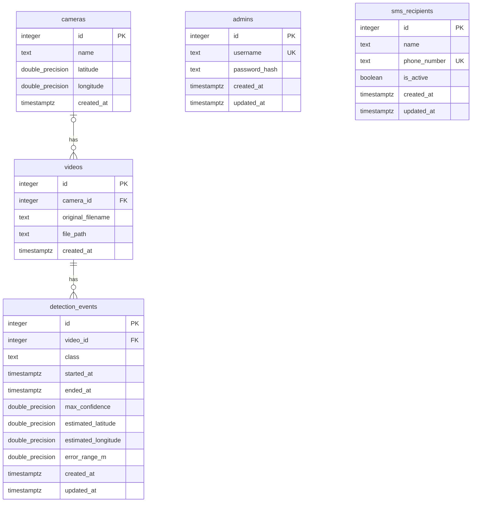

# FireGuard AI 데이터베이스 명세와 ERD

[README](../README.md) · [시스템 아키텍처](System_architecture.md) · [API 명세](API_SPEC.md) · [초기 스키마](../sql/init.sql)

## 적용 범위

- PostgreSQL 초기 스키마와 기존 DB의 누락된 테이블 생성: `sql/init.sql`
- 개발용 카메라·영상 메타데이터: `sql/seed.dev.sql`
- 실제 영상 파일은 DB와 Git에 저장하지 않고 `data/videos/`에 배치
- 테이블과 컬럼 제약의 최종 기준은 SQL 파일

## ERD

- 카메라 1대에 영상 0개 이상, 영상 1개에 카메라 0대 또는 1대
- 영상 1개에 탐지 이벤트 0개 이상, 이벤트는 영상 1개를 반드시 참조
- 관리자와 SMS 수신자 사이에는 FK 없음, 수신자 목록은 시스템 공용
- `PK`는 기본 키, `FK`는 외래 키, `UK`는 고유 제약

## 공통 규칙

- `id`: PostgreSQL `INTEGER GENERATED ALWAYS AS IDENTITY`로 자동 생성
- `created_at`: 기본값 `CURRENT_TIMESTAMP`, 영상 촬영 시각이 아닌 DB 등록 시각
- 시각 컬럼: `TIMESTAMPTZ`, 입력에는 시간대를 명시하고 조회 API는 UTC 문자열 반환
- 참조 중인 카메라·영상은 연쇄 삭제되지 않음
- 다른 로컬 DB의 생성 ID를 동일하다고 가정하지 않음
- 조회 인덱스: `videos.camera_id`, `detection_events.video_id`

## 테이블별 필드

### `cameras` · 카메라 설치 정보

| 필드 | 입력 | 의미·제약 |
| --- | --- | --- |
| `id` | 자동 | 기본 키 |
| `name` | 필수 | 공백 불가, 고유 제약 없음 |
| `latitude`, `longitude` | 선택 | 설치 위도 -90~90, 경도 -180~180, 둘 다 값이 있거나 둘 다 `NULL` |
| `created_at` | 자동 | 등록 시각 |

- 실제 설치 위치를 모르면 임의 좌표를 넣지 않음
- 이름이 같아도 DB가 막지 않으므로 등록 전에 중복 확인 필요

### `videos` · 로컬 영상 메타데이터

| 필드 | 입력 | 의미·제약 |
| --- | --- | --- |
| `id` | 자동 | 기본 키 |
| `camera_id` | 선택 | `cameras.id` 참조, 모르면 `NULL` |
| `original_filename` | 필수 | 공백 불가 |
| `file_path` | 필수 | 공백 불가, 고유 제약 없음 |
| `created_at` | 자동 | 등록 시각 |

- 경로는 프로젝트 기준 `data/videos/파일명.mp4` 형태로 관리
- DB는 경로 형식이나 실제 파일 존재를 검사하지 않음
- 같은 카메라의 여러 영상은 같은 `camera_id`와 서로 다른 영상 ID 사용
- 데모 시작 조건: 등록 영상 정확히 4개, 모두 서로 다른 카메라에 연결, 파일 모두 읽기 가능
- 데모의 카메라당 영상 하나 조건은 SQL 제약이 아니며 Backend가 시작 전에 검사
- 장기적으로 카메라별 과거 영상을 보관할 수 있도록 ERD의 일대다 관계 유지
- 영상 목록 API는 `file_path`를 노출하지 않고 스트리밍 API가 `data/videos/` 내부 파일만 제공

### `detection_events` · 연속 탐지 이벤트

| 필드 | 입력 | 의미·제약 |
| --- | --- | --- |
| `id` | 자동 | 기본 키 |
| `video_id` | 필수 | `videos.id` 참조 |
| `class` | 필수 | 공백 불가, DB는 클래스 종류를 제한하지 않음 |
| `started_at` | 필수 | 첫 탐지를 받은 실제 시각 |
| `ended_at` | 선택 | 마지막 탐지 시각, `started_at` 이상 |
| `max_confidence` | 필수 | 0~1 |
| `estimated_latitude`, `estimated_longitude` | 선택 | 위도 -90~90, 경도 -180~180, 함께 값 또는 함께 `NULL` |
| `error_range_m` | 선택 | 0 이상의 유한한 수, 위치 좌표가 없으면 `NULL` |
| `created_at`, `updated_at` | 자동 | `updated_at`은 수정 시 Backend가 갱신 |

- AI 목표 JSON은 `camera_id`를 보내고 Backend가 실행 중인 영상의 `video_id`를 찾아 저장
- `started_at`은 영상 속 과거 촬영 시각이나 재생 위치가 아닌 Backend의 AI 결과 수신 시각
- 위치 추정에 실패하면 위치 컬럼을 `NULL`로 저장하고 카메라 설치 좌표로 대체하지 않음
- 영상 프레임별 bbox, 데모 실행 상태, SMS 발송 이력은 현재 스키마에 저장하지 않음
- `fire`·`smoke`의 이벤트 확정·종료 기준과 대표 위치 선정 방식은 구현 전에 결정
- 현재 탐지 API는 입력 확인만 수행하며 이벤트 저장은 미구현

### `admins` · 관리자 로그인

| 필드 | 입력 | 의미·제약 |
| --- | --- | --- |
| `id` | 자동 | 기본 키 |
| `username` | 필수 | 공백 불가, 고유 |
| `password_hash` | 필수 | 공백 불가, 원문 비밀번호 저장 금지 |
| `created_at`, `updated_at` | 자동 | 수정 시 `updated_at` 갱신 |

- 초기 관리자 계정은 하나로 계획
- JWT는 DB에 저장하지 않음
- 최초 계정 생성과 JWT 만료·폐기는 구현 전에 결정

### `sms_recipients` · 공용 SMS 수신자

| 필드 | 입력 | 의미·제약 |
| --- | --- | --- |
| `id` | 자동 | 기본 키 |
| `name` | 필수 | 공백 불가 |
| `phone_number` | 필수 | 공백 불가, 고유 |
| `is_active` | 자동 | 기본값 `TRUE`, 실제 알림 대상 여부 |
| `created_at`, `updated_at` | 자동 | 수정 시 `updated_at` 갱신 |

- 활성 수신자가 SMS 발송 대상
- `fire`·`smoke`별 문구 사용, 문구·발송 기준·중복·실패 처리는 구현 전에 결정
- SMS 업체 인증 정보는 DB의 이 테이블이나 Frontend에 저장하지 않음
- 전화번호 표준화 방식과 발송 이력 저장 필요성은 연동 전에 결정

## 데이터 준비와 변경

- 새 DB: `sql/init.sql`로 다섯 테이블 생성
- 기존 DB: `sql/init.sql`을 실행해 누락된 관리자·SMS 수신자 테이블 생성
- 이미 존재하는 테이블의 컬럼·제약조건은 `sql/init.sql`로 변경되지 않음
- 샘플 영상: 조장에게 받은 파일을 `data/videos/`에 놓고 `sql/seed.dev.sql`로 메타데이터 등록
- 등록 순서: 카메라 → 생성 ID 확인 → 영상과 카메라 연결 → 영상 ID 확인
- 파일만 배치해도 DB에 자동 등록되지 않음
- 일반 영상 등록 API는 아직 미구현
- 현재 탐지 API는 이전 JSON의 `video_id`, `timestamp`, 위치 객체를 필수로 검사하므로 목표 JSON 연동 전에 변경 필요
- 적용 명령은 [README](../README.md#기존-db에-스키마-적용) 참고
