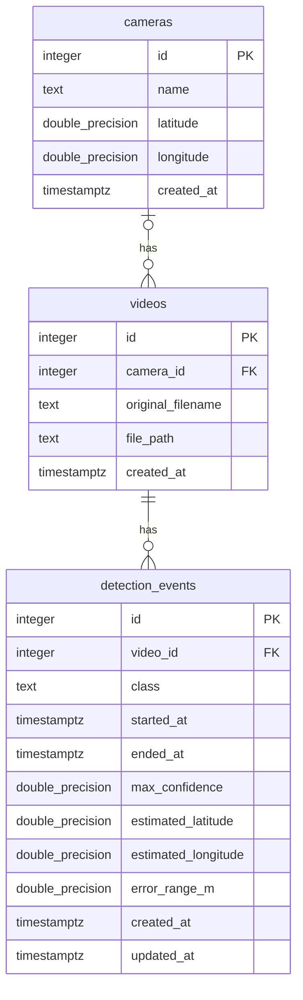

# 데이터베이스 명세

[프로젝트 소개](../README.md) · [시스템 아키텍처](System_architecture.md) · [개발 환경 안내](DEVELOPMENT.md) · [API 명세서](API_SPEC.md)

현재 PostgreSQL 테이블 생성 코드인 [sql/init.sql](../sql/init.sql)을 설명하는 문서입니다. 스키마를 변경하면 SQL과 이 문서를 함께 갱신합니다. 기존 DB에 변경을 적용하는 방법은 개발 환경 안내에서 관리합니다.

## ERD

- 카메라 한 대에 영상이 0개 이상 연결됩니다. 영상의 카메라는 없거나 한 대입니다.
- 영상 하나에 이벤트가 0개 이상 연결됩니다. 이벤트는 반드시 영상 하나에 연결됩니다.
- `PK`는 행을 식별하는 기본 키, `FK`는 다른 테이블의 행을 참조하는 외래 키입니다.
- 그림의 `double_precision`은 PostgreSQL의 `DOUBLE PRECISION`을 뜻합니다.

## 공통 입력 규칙

- 각 테이블의 `id`는 `INTEGER GENERATED ALWAYS AS IDENTITY`로 자동 생성됩니다. INSERT할 때 직접 번호를 매기지 않습니다.
- 아래 표의 **필수**는 NULL을 허용하지 않고 기본값도 없어 등록 시 값을 제공해야 한다는 뜻입니다. **선택**은 NULL 허용, **자동**은 생략하면 DB가 기본값을 채운다는 뜻입니다.
- `created_at`은 `CURRENT_TIMESTAMP`가 기본값인 DB 등록 시각입니다. 영상 촬영 시각과 다릅니다.
- 날짜 타입은 `TIMESTAMPTZ`입니다. 입력할 때 `2026-10-08T15:00:00+09:00`처럼 시간대를 명시합니다. 조회 API는 UTC 문자열로 반환하고 화면에서 한국 시각으로 변환합니다.
- 다른 데이터가 참조 중인 카메라나 영상은 그대로 삭제할 수 없습니다. 외래 키에 연쇄 삭제를 설정하지 않았습니다.

## cameras — 카메라 정보

카메라 이름과 실제 설치 좌표를 저장합니다.

| 컬럼 | 타입 | 입력 | 의미·제약조건 |
| --- | --- | --- | --- |
| `id` | INTEGER | 자동 | 카메라 ID, 기본 키 |
| `name` | TEXT | 필수 | 카메라 이름. 빈 문자열이나 공백만 있는 값은 거절 |
| `latitude` | DOUBLE PRECISION | 선택 | 설치 위도, -90~90 |
| `longitude` | DOUBLE PRECISION | 선택 | 설치 경도, -180~180 |
| `created_at` | TIMESTAMPTZ | 자동 | DB 등록 시각 |

위도와 경도는 함께 입력하거나 함께 NULL로 둡니다. 설치 위치를 모르면 임의 좌표를 넣지 않습니다. 이름에는 UNIQUE 제약이 없으므로 같은 카메라가 이미 등록되어 있는지 확인한 뒤 등록합니다.

## videos — 영상 메타데이터

영상 파일 자체는 `data/videos/` 등 파일시스템에 두고, DB에는 파일명·경로·카메라 연결을 저장합니다.

| 컬럼 | 타입 | 입력 | 의미·제약조건 |
| --- | --- | --- | --- |
| `id` | INTEGER | 자동 | 영상 ID, 기본 키 |
| `camera_id` | INTEGER | 선택 | `cameras.id` 참조. 촬영 카메라를 모르면 NULL |
| `original_filename` | TEXT | 필수 | 원본 파일명. 빈 문자열이나 공백만 있는 값은 거절 |
| `file_path` | TEXT | 필수 | 저장 경로. 빈 문자열이나 공백만 있는 값은 거절 |
| `created_at` | TIMESTAMPTZ | 자동 | DB 등록 시각 |

경로는 프로젝트 기준 상대 경로인 `data/videos/파일명.mp4` 형태로 관리하는 방향입니다. DB 자체는 경로 형식이나 실제 파일의 존재를 검사하지 않으므로 등록할 때 확인해야 합니다. `file_path`에 UNIQUE 제약은 없으며, 같은 파일의 중복 등록도 별도로 확인해야 합니다.

같은 카메라에서 촬영된 영상 여러 개는 같은 `camera_id`를 사용하고, 각각 다른 `id`를 가집니다. 파일명만으로 동일 카메라인지 단정하지 않습니다. 현재 영상 조회 API는 내부 저장 경로인 `file_path`를 반환하지 않습니다.

## detection_events — 탐지 이벤트

연속 탐지를 하나의 이벤트로 묶어 시작·종료 시각과 대표 결과를 저장하기 위한 테이블입니다. 그룹핑 기준과 대표 위치 선정 방식은 아직 미정이며, AI 수신 API의 저장 로직도 미구현입니다.

| 컬럼 | 타입 | 입력 | 의미·제약조건 |
| --- | --- | --- | --- |
| `id` | INTEGER | 자동 | 이벤트 ID, 기본 키 |
| `video_id` | INTEGER | 필수 | `videos.id` 참조 |
| `class` | TEXT | 필수 | 탐지 클래스. 예: fire, smoke. DB는 빈 문자열·공백만 거절하며 클래스 목록은 제한하지 않음 |
| `started_at` | TIMESTAMPTZ | 필수 | 첫 탐지의 실제 시각. 영상 재생 위치와 다름 |
| `ended_at` | TIMESTAMPTZ | 선택 | 종료 시 마지막 탐지 시각. 진행 중에는 NULL, 입력 시 started_at 이상 |
| `max_confidence` | DOUBLE PRECISION | 필수 | 이벤트의 최대 탐지 신뢰도, 0~1 |
| `estimated_latitude` | DOUBLE PRECISION | 선택 | 추정 화점 위도, -90~90 |
| `estimated_longitude` | DOUBLE PRECISION | 선택 | 추정 화점 경도, -180~180 |
| `error_range_m` | DOUBLE PRECISION | 선택 | 추정 오차 범위(미터), 0 이상의 유한한 값 |
| `created_at` | TIMESTAMPTZ | 자동 | DB 등록 시각 |
| `updated_at` | TIMESTAMPTZ | 등록 시 자동 | 등록 기본값은 CURRENT_TIMESTAMP. 이후 수정 시 Backend가 직접 갱신 |

추정 위도·경도는 함께 입력하거나 함께 NULL로 둡니다. `error_range_m`을 입력하려면 추정 좌표도 있어야 합니다. 좌표가 있어도 오차 범위는 NULL일 수 있습니다. 오차 범위의 산정 방식과 의미는 AI 담당자와 합의해야 합니다.

이 테이블에는 카메라 ID를 중복 저장하지 않습니다. `video_id → videos.camera_id`로 카메라를 찾습니다. 영상 프레임별 bbox도 현재 스키마에 저장하지 않습니다.

## 실제 영상 등록 전 준비할 정보

| 준비 항목 | 확인 방법 | 저장 위치 |
| --- | --- | --- |
| 카메라 이름·동일 카메라 여부 | 제공자·영상 출처에서 확인 | cameras.name, videos.camera_id |
| 실제 카메라 설치 위도·경도 | 제공된 위치 정보 확인 | cameras.latitude, cameras.longitude |
| 영상 원본 파일명 | 로컬 파일 확인 | videos.original_filename |
| 영상 저장 경로 | 실제 파일 배치 확인 | videos.file_path |

등록 순서는 **카메라 등록 → 생성된 ID 확인 → 영상 등록 및 카메라 연결 → 영상 ID 확인**입니다. 카메라를 모르는 영상은 `camera_id = NULL`로 먼저 등록할 수 있습니다. 이벤트 저장 시에는 등록된 영상 ID를 사용합니다.

DB가 자동으로 만드는 ID는 팀원별 로컬 DB에서 달라질 수 있으므로 특정 파일의 번호를 미리 고정하지 않습니다. INSERT 결과의 `RETURNING id`나 조회 API로 확인합니다.

## 현재 범위와 남은 결정 사항

- 카메라 고도·방위각·화각·보정값, 영상 촬영 시각·길이·FPS는 현재 컬럼에 없습니다. 위치 추정에 필요한 항목을 확인한 뒤 추가합니다.
- DB는 카메라 없는 영상과 위치 없는 이벤트를 허용하지만, 현재 `POST /api/detections`는 camera_id와 위치 좌표 객체를 필수로 검사합니다. 실제 저장 연동 전에 규칙을 맞춰야 합니다.
- 파일을 `data/videos/`에 배치해도 DB에 자동 등록되지 않습니다. 영상 등록 API와 AI 결과 저장·이벤트 갱신 로직은 아직 미구현입니다.
- `videos.camera_id`, `detection_events.video_id`에 조회용 인덱스가 있습니다. 기본 키에는 PostgreSQL이 고유 인덱스를 자동 생성합니다.
