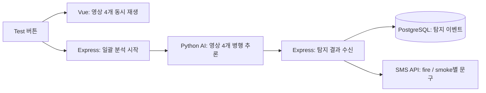

# FireGuard AI 시스템 아키텍처

[README](../README.md) · [API 명세](API_SPEC.md) · [ERD](DATABASE.md) · [ADR](ADR.md)

## 현재 목표: 4개 영상 데모

- 실시간 CCTV 영상 API를 받기 전까지 `data/videos/`의 녹화 영상 4개로 실시간 입력을 대체
- Test 버튼 한 번으로 영상 4개를 처음부터 재생하고 AI 분석을 시작
- 사용자에게 일시정지·되감기·탐색 기능을 제공하지 않음
- Backend가 영상 경로와 카메라 ID를 같은 서버의 Python 추론 코드에 전달
- AI가 영상 재생 시간에 맞춰 추론하고 탐지 결과를 Backend에 JSON으로 전달
- Backend가 결과 수신 시각을 탐지 시각으로 기록하고 연속 탐지를 이벤트로 묶어 저장
- `fire`와 `smoke` 모두 SMS 대상이며 문구를 구분
- 실시간 바운딩박스 표시는 이번 단계에서 제외
- 4개 영상 동시 추론 속도와 화면·알림 간 지연은 실제 서버에서 검증 필요

## 구현 현황

| 영역 | 현재 구현 | 다음 작업 |
| --- | --- | --- |
| AI · YOLO26n | 학습 가중치와 결과 보관 | `ai/infer.py`, 영상 병행 추론, 결과 전송 |
| Backend · Node.js/Express | DB 연결, 영상 스트리밍, 목록·상세 조회, 기존 탐지 JSON 검증·반환 | 일괄 실행, 목표 JSON 수신, 이벤트 저장, SMS 연동 |
| DB · PostgreSQL | 카메라·영상·이벤트·관리자·SMS 수신자 스키마 | 이벤트 저장 로직 연결 |
| Frontend · Vue/Vite | 지도·조회 화면, 영상 하나를 조작 가능한 플레이어로 재생 | Test 버튼, 조작 없는 영상 4개 동시 재생 |
| 네이버 지도 | 카메라·추정 위치 표시 코드 | 실제 영상·탐지 결과와 연결 |
| 관리자·SMS | DB 테이블만 준비 | JWT 로그인, 수신자 관리, 종류별 SMS 발송 |
| Nginx | 배포 구성 계획 | 정적 파일 제공과 API 프록시 설정 |

- AI는 DB에 직접 접근하지 않음
- 현재 `POST /api/detections`는 이전 개발용 JSON을 검사해 그대로 반환하며 저장·SMS 발송은 수행하지 않음
- 요청·응답 계약과 구현 상태는 [API 명세](API_SPEC.md)에서 관리

## 영상과 데이터

- 영상 파일은 `data/videos/`, 파일 경로와 카메라 연결은 `videos`에 저장
- Backend의 `GET /api/videos/:id/stream`은 해당 폴더의 파일만 제공하고 단일 HTTP Range 요청을 지원
- 현재 DB는 카메라 1대에 영상 여러 개를 허용
- 데모 시작 시 등록 영상이 정확히 4개이고 서로 다른 카메라에 연결되며 파일을 읽을 수 있는지 검사할 계획
- AI 요청의 `camera_id`로 실행 중인 영상을 찾아 이벤트의 `video_id`에 저장할 계획
- 영상 파일과 프레임별 bbox는 DB에 저장하지 않음
- 컬럼·제약조건·ERD는 [DB 명세](DATABASE.md)에서 관리

## 향후 목표: 실시간 CCTV 입력

- 위 그림은 초기 장기 목표 구성도이며 현재 4개 영상 데모의 구현 현황을 나타내지 않음
- 실시간 CCTV 영상 API를 사용할 수 있게 되면 녹화 파일 입력을 실시간 입력으로 교체
- 지도 JavaScript와 Vue 화면은 사용자의 브라우저에서 실행

## 실행과 배포

- 로컬 개발: 브라우저 → Vite `127.0.0.1:5173` → `/api` 프록시 → Express `127.0.0.1:3000` → PostgreSQL
- Frontend는 `/api` 상대 경로 사용
- Vite 프록시는 `/api` 접두사를 유지하므로 로컬 개발에서 별도 CORS 설정 불필요
- 배포 계획: Nginx가 Frontend 빌드 파일과 `/api` 프록시 제공
- Nginx와 Backend가 다른 컨테이너라면 `127.0.0.1` 대신 컨테이너 간 주소와 Backend 수신 주소를 별도로 설정
- 실제 영상·비밀번호는 Git에 포함하지 않으며 SMS 비밀키는 Backend에서만 관리
- Frontend 소스는 Git에 보관하고 `dist/`와 `node_modules/`는 Git에서 제외
- 추론 가중치는 현재 `ai/yolo26n_fire_50/weights/`에서 Git으로 관리

## 구현 전에 확인할 사항

- AI가 실제 화점 위경도를 추정할 수 있는지와 위치가 없을 때 지도 표시 방법
- 4개 영상 병행 추론 속도와 재생·SMS 지연
- 이벤트 확정·종료 기준, SMS 문구·중복 발송·재시도 규칙
- Test 버튼과 AI 결과 수신 API의 접근 제어
- JWT 만료·폐기, 최초 관리자 생성, 전화번호 형식
- 실제 서버의 Nginx·Backend·AI 실행 주소와 가중치 배포 방법
