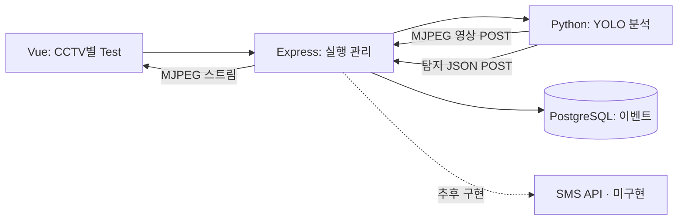

# FireGuard AI 시스템 아키텍처

[API 명세](API_SPEC.md) · [ERD](DATABASE.md) · [ADR](ADR.md)

## 카메라별 Test 목표 흐름

- `source_type=test` 카메라마다 등록된 영상 하나를 분석
- Backend가 Python에 원본 파일 경로와 실행 ID를 전달
- AI가 바운딩박스 프레임과 탐지 JSON을 각각 Backend API로 전송
- Backend가 MJPEG 프레임을 중계하고 탐지 이벤트 저장
- SMS 발송은 아직 구현되지 않음
- 결과 영상 파일은 저장하지 않음

## 구성 요소

| 구성 요소 | 역할 |
| --- | --- |
| Frontend · Vue/Vite | CCTV·탐지 정보 표시, 지도·카메라 선택 연동 · Test/MJPEG 화면은 미구현 |
| Backend · Node.js/Express | API, Python 실행, 영상 중계, 이벤트 저장 · SMS 발송은 미구현 |
| AI · Python/YOLO26n | 영상 프레임 분석, 바운딩박스·탐지 JSON 생성 |
| DB · PostgreSQL | 카메라·영상·이벤트·관리자·SMS 수신자 저장 |
| 지도 · 네이버 Maps | CCTV와 추정 화점 위치 표시 |

## 영상 입력

- `test` 카메라: `data/videos/`의 등록 MP4
- `live` 카메라: ITS API에서 조회한 CCTV 영상 주소
- 원본 파일과 결과 프레임은 DB에 저장하지 않음
- 컬럼과 관계는 [ERD](DATABASE.md), 요청·응답은 [API 명세](API_SPEC.md) 참고

## 현재 구현 상태

- Backend 구현: 카메라·영상·이벤트 조회, 로컬 영상 스트리밍, 관리자 로그인·JWT 인증, 카메라별 Test 실행, AI 프로세스 실행, MJPEG 중계, 탐지 JSON 검증·저장
- Frontend 구현: 대시보드·지도 마커·카메라와 영상 선택 연동
- 미구현: 관리자 로그인 화면, CCTV별 Test 버튼과 탐지 영상 화면 연동, ITS 실시간 CCTV API 연동, SMS 수신자 관리·발송, 위치 추정 결과 연동
- 개발 환경: 브라우저 → Vite → Express → PostgreSQL
